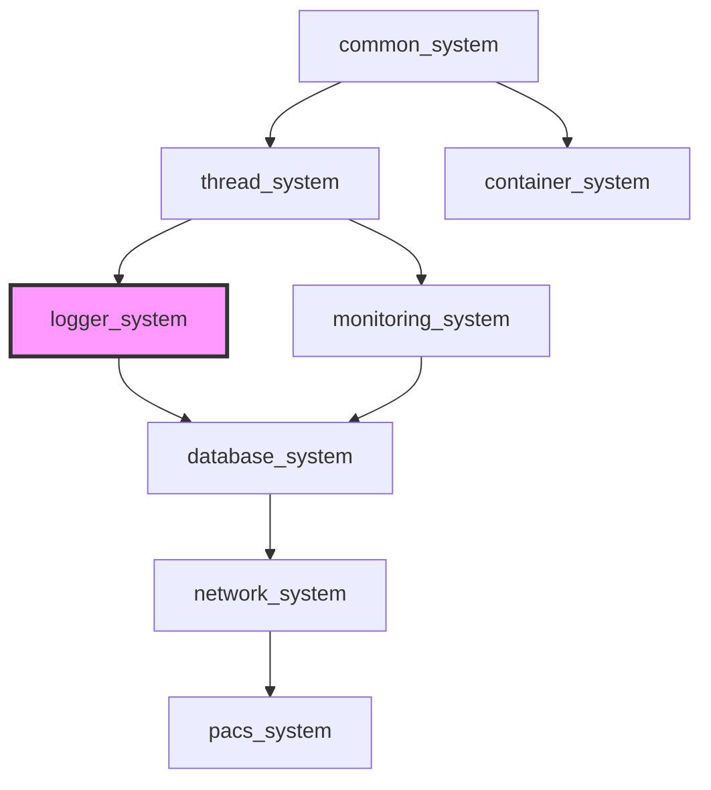

[](https://github.com/kcenon/logger_system/actions/workflows/ci.yml)
[](https://github.com/kcenon/logger_system/actions/workflows/sanitizers.yml)
[](https://github.com/kcenon/logger_system/actions/workflows/benchmarks.yml)
[](https://github.com/kcenon/logger_system/actions/workflows/coverage.yml)
[](https://github.com/kcenon/logger_system/actions/workflows/static-analysis.yml)
[](https://codecov.io/gh/kcenon/logger_system)
[](https://github.com/kcenon/logger_system/actions/workflows/build-Doxygen.yaml)
[](https://github.com/kcenon/logger_system/blob/main/LICENSE)

# Logger System

> **Language:** [English](README.md) | **한국어**

## 목차

- [개요](#개요)
- [프로젝트 레이아웃](#프로젝트-레이아웃)
- [빠른 시작](#빠른-시작)
- [설치](#설치)
- [핵심 기능](#핵심-기능)
- [성능 하이라이트](#성능-하이라이트)
- [아키텍처 개요](#아키텍처-개요)
- [생태계 통합](#생태계-통합)
- [C++20 모듈 지원](#c20-모듈-지원)
- [문서](#문서)
- [컴플라이언스](#컴플라이언스)
- [구성 템플릿](#구성-템플릿)
- [빌드 구성](#빌드-구성)
- [플랫폼 지원](#플랫폼-지원)
- [테스트](#테스트)
- [기여하기](#기여하기)
- [라이선스](#라이선스)

## 개요

멀티스레드 애플리케이션을 위해 설계된 고성능 C++20 비동기 로깅 프레임워크입니다. 모듈식 인터페이스 기반 아키텍처와 원활한 생태계 통합을 바탕으로 구축되었습니다.

**핵심 기능**:
- 🚀 **초고속 비동기 로깅**: 초당 4.34M 메시지, 148ns 지연
- 🔒 **설계 기반 스레드 안전성**: 데이터 레이스 제로, 프로덕션 검증
- 🏗️ **모듈식 아키텍처**: 인터페이스 기반, 플러그인 가능한 컴포넌트
- 🛡️ **프로덕션 등급**: 포괄적 CI/CD, sanitizer, 벤치마크
- 🔐 **보안 우선**: 경로 검증, 보안 저장소, 감사 로깅
- 🌐 **크로스 플랫폼**: Windows, Linux, macOS (GCC, Clang, MSVC)

---

## 프로젝트 레이아웃

`logger_system`은 [kcenon 생태계 레이아웃 표준](https://github.com/kcenon/common_system/blob/develop/docs/kcenon-system-layout.md) (v1.1)을 따르며, 해당 컨벤션의 참조 예시 역할을 합니다. 모든 kcenon 시스템이 공유하는 정규 디렉터리 구조, CMake 타겟 네이밍, 시스템 간 통합 규칙은 해당 문서를 참조하세요.

---

## 빠른 시작

### 기본 예제

```cpp
#include <kcenon/logger/core/logger_builder.h>
#include <kcenon/logger/writers/console_writer.h>
#include <kcenon/logger/writers/file_writer.h>

int main() {
    // 빌더 패턴으로 logger 생성 (자동 검증 포함)
    auto result = kcenon::logger::logger_builder()
        .use_template("production")  // 사전 정의된 구성
        .with_min_level(kcenon::logger::log_level::info)
        .add_writer("console", std::make_unique<kcenon::logger::console_writer>())
        .add_writer("file", std::make_unique<kcenon::logger::file_writer>("app.log"))
        .build();

    if (result.is_err()) {
        const auto& err = result.error();
        std::cerr << "Failed to create logger: " << err.message
                  << " (code: " << err.code << ")\n";
        return -1;
    }

    auto logger = std::move(result.value());

    // 오류 처리와 함께 메시지 로깅
    logger->log(kcenon::logger::log_level::info, "Application started");
    logger->log(kcenon::logger::log_level::error, "Something went wrong");

    return 0;
}
```

나중에 빠르게 참고할 내용이 필요하신가요? 생태계 전반에서 재사용할 수 있는 정규 스니펫은 [Result 처리 치트시트](docs/guides/INTEGRATION.md#result-handling-cheatsheet)를 참조하세요.

### 데코레이터 패턴으로 Writer 조합하기

`writer_builder`는 데코레이터 패턴을 사용하여 여러 Writer 동작을 조합하는 플루언트 API를 제공합니다:

```cpp
#include <kcenon/logger/builders/writer_builder.h>

// 비동기 및 버퍼 데코레이터가 적용된 파일 writer 생성
auto writer = kcenon::logger::writer_builder()
    .file("app.log")
    .buffered(500)           // 최대 500개 항목 버퍼링
    .async(20000)            // 비동기 큐 크기 20000
    .build();

// logger에 추가
logger->add_writer("main", std::move(writer));
```

**사용 가능한 코어 Writer**:
- `.file(path)` - 파일에 기록
- `.console()` - 콘솔(stdout/stderr)에 기록
- `.custom(writer)` - 사용자 정의 writer 구현 사용

**사용 가능한 데코레이터**:
- `.async(queue_size)` - 백그라운드 스레드를 통한 비동기 기록
- `.buffered(max_entries)` - I/O 작업을 줄이기 위한 배치 버퍼링
- `.filtered(filter)` - 레벨 또는 사용자 정의 기준 기반 로그 필터링
- `.formatted(formatter)` - 기록 전 사용자 정의 포매팅
- `.encrypted(key)` - 민감한 로그를 위한 AES-256 암호화 (encryption 기능 필요)
- `.thread_safe()` - 동시 접근을 위한 스레드 안전 래퍼

#### 데코레이터 적용 순서

최적의 성능을 위해 데코레이터는 다음 순서(가장 안쪽에서 가장 바깥쪽)로 적용해야 합니다:

```
Core Writer → Filtering → Buffering → Encryption → Thread-Safety → Async
```

**근거**:
1. **Filtering 먼저** - 다운스트림 데코레이터의 작업량 감소
2. **Buffering** - I/O 및 처리 비용 분산
3. **Encryption** - 배치 단위 효율적 암호화
4. **Thread-safety** - 비동기 처리 전 일관성 보장
5. **Async 마지막** - 논블로킹 이점 극대화

#### 일반적인 사용 패턴

**고처리량 패턴** (초당 4M+ 메시지):
```cpp
auto writer = kcenon::logger::writer_builder()
    .file("app.log")
    .buffered(1000)      // 큰 버퍼
    .async(50000)        // 큰 큐
    .build();
```

**보안 로깅 패턴** (컴플라이언스):
```cpp
#ifdef LOGGER_WITH_ENCRYPTION
auto writer = kcenon::logger::writer_builder()
    .file("audit.log.enc")
    .buffered(200)                      // 암호화 전 버퍼링
    .encrypted(std::move(encryption_key))
    .async(10000)
    .build();
#endif
```

**필터링된 오류 로그** (오류 추적 분리):
```cpp
auto error_filter = std::make_unique<level_filter>(log_level::error);
auto error_writer = kcenon::logger::writer_builder()
    .file("errors.log")
    .filtered(std::move(error_filter))  // 필터링 먼저
    .buffered(100)
    .async()
    .build();
```

**프로덕션 멀티 Writer 설정**:
```cpp
logger log;

// 메인 로그: 고성능을 위해 async+buffered가 적용된 모든 메시지
auto main_writer = kcenon::logger::writer_builder()
    .file("app.log")
    .buffered(500)
    .async(20000)
    .build();

// logger에 추가하기 전에 async writer 시작
if (auto* async_w = dynamic_cast<async_writer*>(main_writer.get())) {
    async_w->start();
}
log.add_writer("main", std::move(main_writer));

// 오류 로그: 오류만, 별도 파일
auto error_filter = std::make_unique<level_filter>(log_level::error);
auto error_writer = kcenon::logger::writer_builder()
    .file("errors.log")
    .filtered(std::move(error_filter))
    .async()
    .build();

if (auto* async_w = dynamic_cast<async_writer*>(error_writer.get())) {
    async_w->start();
}
log.add_writer("errors", std::move(error_writer));

// 개발용 콘솔
log.add_writer("console", writer_builder().console().build());
```

모든 데코레이터, 성능 패턴, 실제 시나리오를 포함한 포괄적인 예제는 다음을 참조하세요:
- [examples/decorator_usage.cpp](examples/decorator_usage.cpp) - 완전한 데코레이터 패턴 가이드
- [examples/writer_builder_example.cpp](examples/writer_builder_example.cpp) - 빌더 패턴 예제

> **마이그레이션 안내**: 수동 데코레이터 중첩을 사용하는 이전 버전에서 업그레이드하는 경우, 마이그레이션 시나리오는 [데코레이터 패턴 마이그레이션 가이드](docs/guides/DECORATOR_MIGRATION.md#deprecation-timeline-and-legacy-patterns)를 참조하세요. 수동 중첩은 `writer_builder`를 선호하여 더 이상 권장되지 않으며 v5.0.0에서 비권장됩니다.

### 설치

**vcpkg 사용**:
```bash
# 기본 기능 세트로 설치 (선택적 서드파티 의존성 없음)
vcpkg install kcenon-logger-system

# 벤치마크 포함 설치 (비교용 spdlog 포함)
vcpkg install kcenon-logger-system[benchmarks]

# OpenTelemetry 통합 포함 설치
vcpkg install kcenon-logger-system[otlp]

# 암호화 지원 포함 설치
vcpkg install kcenon-logger-system[encryption]
```

> **참고**: 생태계 의존성(common_system, thread_system)은 아직 vcpkg에 등록되지 않았습니다. 그때까지는 로컬 클론을 사용한 CMake 빌드를 사용하세요. [의존성과 함께 빌드](#의존성과-함께-빌드)를 참조하세요.

**CMake 사용**:
```bash
mkdir build && cd build
cmake ..
cmake --build .
cmake --build . --target install
```

**프로젝트에서 사용**:
```cmake
find_package(logger_system REQUIRED)
target_link_libraries(your_app PRIVATE logger_system::logger_system)
```

### 요구사항

| 의존성 | 버전 | 필수 | 설명 |
|------------|---------|----------|-------------|
| C++20 컴파일러 | GCC 11+ / Clang 14+ / MSVC 2022+ / Apple Clang 14+ | 예 | C++20 기능 필수 |
| CMake | 3.20+ | 예 | 빌드 시스템 |
| [common_system](https://github.com/kcenon/common_system) | latest | 예 | 공통 인터페이스 (ILogger, Result<T>) |
| [thread_system](https://github.com/kcenon/thread_system) | latest | 선택 | 스레드 풀 지원 비동기 로깅 |
| [kcenon-common-system](https://github.com/kcenon/common_system) | 0.2.0 | 예 | vcpkg를 통해 자동 설치 (`kcenon-common-system`) |
| vcpkg | latest | 선택 | 패키지 관리 |

> **참고**: `kcenon-common-system`은 유일한 필수 프로덕션 의존성이며 vcpkg 사용 시 자동으로 설치됩니다. 선택적 기능은 명시적으로 활성화된 경우에만 OpenSSL(`encryption`), OpenTelemetry/gRPC/Protocol Buffers(`otlp`), spdlog(`benchmarks`)를 추가합니다. 권위 있는 의존성 인벤토리는 [docs/SOUP.md](docs/SOUP.md)와 [LICENSE-THIRD-PARTY](LICENSE-THIRD-PARTY)를 참조하세요.

#### 선택적 기능 의존성

| 기능 | 서드파티 의존성 | 목적 |
|---------|--------------------------|---------|
| `encryption` | OpenSSL | AES-256-GCM 암호화 로그 writer |
| `otlp` | OpenTelemetry C++ SDK, gRPC, Protocol Buffers | OTLP 텔레메트리 내보내기 |
| `benchmarks` | spdlog | 다른 로깅 라이브러리와의 벤치마크 비교 |
| `thread-system` | kcenon-thread-system | 스레드 풀 및 비동기 실행기 통합 |

#### 개발 및 벤치마크 의존성

| 카테고리 | 의존성 | 목적 |
|----------|--------------|---------|
| 테스트 전용 | Google Test | 단위 테스트 및 목 |
| 벤치마크 전용 | Google Benchmark | 성능 벤치마크 |

#### 의존성 흐름

```
logger_system
├── common_system (필수)
└── thread_system (선택, 스레드 풀 기반 비동기 로깅)
    └── common_system (필수)
```

#### 의존성과 함께 빌드

```bash
# 의존성 클론
git clone https://github.com/kcenon/common_system.git
git clone https://github.com/kcenon/thread_system.git  # 선택 사항

# logger_system 클론 및 빌드
git clone https://github.com/kcenon/logger_system.git
cd logger_system
cmake -B build -DLOGGER_USE_THREAD_SYSTEM=ON  # thread_system 통합 활성화
cmake --build build
```

---

## 핵심 기능

### 비동기 로깅
- **논블로킹 작업**: 백그라운드 스레드가 블로킹 없이 I/O 처리
- **배치 처리**: 여러 로그 항목을 효율적으로 처리
- **적응형 배칭**: 큐 활용도 기반 지능형 최적화
- **제로 카피 설계**: 최소한의 할당과 오버헤드

### 다양한 Writer 유형
- **Console Writer**: 로그 레벨별 ANSI 컬러 출력
- **File Writer**: 구성 가능한 설정의 버퍼링 파일 출력
- **Rotating File Writer**: 압축을 지원하는 크기/시간 기반 로테이션
- **Network Writer**: TCP/UDP 원격 로깅
- **Critical Writer**: 중요 메시지를 위한 동기 로깅
- **Hybrid Writer**: 로그 레벨 기반 자동 비동기/동기 전환
- **Encrypted Writer**: AES-256-GCM 암호화 로그 저장
- **OTLP Writer**: 관측성을 위한 OpenTelemetry Protocol 내보내기 (v3.0.0)

[📚 상세 Writer 문서 →](docs/FEATURES.md#writer-types)

### OpenTelemetry 통합 (v3.0.0)
- **트레이스 상관관계**: 로그에 trace_id/span_id 자동 포함
- **OTLP 내보내기**: HTTP 및 gRPC 전송 프로토콜
- **배치 내보내기**: 효율적인 네트워크 활용
- **리소스 속성**: 서비스 이름, 버전, 사용자 정의 메타데이터
- **컨텍스트 전파**: 스레드 로컬 트레이스 컨텍스트 저장

[🔭 OpenTelemetry 가이드 →](docs/guides/OPENTELEMETRY.md)

### 보안 기능 (v3.0.0)
- **보안 키 저장소**: 자동 정리 기능을 갖춘 RAII 기반 암호화 키 관리
- **Encrypted Writer**: 항목별 IV 로테이션을 갖춘 AES-256-GCM 암호화 로그 저장
- **경로 검증**: 경로 순회 공격 방지
- **시그널 핸들러 안전성**: 크래시 시나리오를 위한 긴급 플러시
- **보안 감사 로깅**: HMAC-SHA256 기반 변조 감지 감사 추적
- **컴플라이언스 지원**: GDPR, PCI DSS, ISO 27001, SOC 2

[🔒 전체 보안 가이드 →](docs/FEATURES.md#security-features)

### 구조화 로깅 (v3.1.0)
- **플루언트 빌더 API**: `.field("key", value).emit()`로 필드 추가 체이닝
- **타입 안전 필드**: string, int64, double, boolean 값 지원
- **컨텍스트 필드**: 모든 로그에 자동 포함되는 영구 필드
- **JSON 출력**: JSON 포매터 출력의 구조화 필드
- **레벨별 메서드**: `info_structured()`, `error_structured()` 등

```cpp
// 영구 컨텍스트 필드 설정
logger->set_context("service", "api-gateway");
logger->set_context("version", "1.0.0");

// 구조화 로그 항목 생성
logger->info_structured()
    .message("User login")
    .field("user_id", 12345)
    .field("ip_address", "192.168.1.1")
    .field("success", true)
    .emit();
```

---

## 성능 하이라이트

*Apple M1 (8코어) @ 3.2GHz, 16GB, macOS Sonoma에서 벤치마크 측정*

### 처리량

| 구성 | 처리량 | spdlog 대비 |
|---------------|------------|-----------|
| **단일 스레드 (비동기)** | **4.34M msg/s** | -19% |
| **4 스레드** | **1.07M msg/s** | **+36%** |
| **8 스레드** | **412K msg/s** | **+72%** |
| **16 스레드** | **390K msg/s** | **+117%** |

### 지연

| 메트릭 | Logger System | spdlog 비동기 | 우위 |
|--------|---------------|--------------|-----------|
| **평균** | **148 ns** | 2,325 ns | **15.7배 빠름** |
| **p99** | **312 ns** | 4,850 ns | **15.5배 빠름** |
| **p99.9** | **487 ns** | ~7,000 ns | **14.4배 빠름** |

### 메모리 효율성

- **기준치**: 1.8 MB (spdlog 대비: 4.2 MB, **57% 적음**)
- **피크**: 2.4 MB
- **메시지당 할당**: 0.12

**핵심 인사이트**:
- 🏃 **멀티스레드 우위**: 적응형 배칭이 우수한 확장성 제공
- ⏱️ **초저지연**: 업계 최고 수준의 148ns 평균 인큐 시간
- 💾 **메모리 효율적**: 제로 카피 설계로 최소 풋프린트

[⚡ 전체 벤치마크 및 방법론 →](docs/BENCHMARKS.md)

---

## 아키텍처 개요

### 모듈식 설계

```
┌─────────────────────────────────────────────────────────────┐
│                      Logger Core                            │
│  ┌──────────────┐  ┌──────────────┐  ┌──────────────┐      │
│  │   Builder    │  │  Async Queue │  │   Metrics    │      │
│  └──────────────┘  └──────────────┘  └──────────────┘      │
└───────────────────────┬─────────────────────────────────────┘
                        │
        ┌───────────────┼───────────────┐
        │               │               │
        ▼               ▼               ▼
┌──────────────┐ ┌──────────────┐ ┌──────────────┐
│   Writers    │ │   Filters    │ │  Formatters  │
│              │ │              │ │              │
│ • Console    │ │ • Level      │ │ • Plain Text │
│ • File       │ │ • Regex      │ │ • JSON       │
│ • Rotating   │ │ • Function   │ │ • Logfmt     │
│ • Network    │ │ • Composite  │ │ • Custom     │
│ • Critical   │ │              │ │              │
│ • Hybrid     │ │              │ │              │
└──────────────┘ └──────────────┘ └──────────────┘
```

### 주요 컴포넌트

- **Logger Core**: 빌더 패턴을 갖춘 메인 비동기 처리 엔진
- **Writers**: 플러그인 가능한 출력 대상 (파일, 콘솔, 네트워크 등)
- **Filters**: 레벨, 패턴 또는 사용자 정의 로직 기반 조건부 로깅
- **Formatters**: 구성 가능한 출력 형식 (plain, JSON, logfmt, custom)
- **Security**: 경로 검증, 보안 저장소, 감사 로깅

[🏛️ 상세 아키텍처 가이드 →](docs/ARCHITECTURE.md)

---

## 생태계 통합

### 생태계 의존성 맵



> **생태계 참조**:
> [common_system](https://github.com/kcenon/common_system) — Tier 0: ILogger 인터페이스 및 Result&lt;T&gt; 패턴
> [thread_system](https://github.com/kcenon/thread_system) — Tier 1: 비동기 로그 처리를 위한 스레드 풀 (선택)
> [monitoring_system](https://github.com/kcenon/monitoring_system) — Tier 3: 메트릭 및 헬스 모니터링 (선택)

깔끔한 인터페이스 경계를 갖춘 모듈식 C++ 생태계의 일부입니다:

### 의존성

**필수**:
- **[common_system](https://github.com/kcenon/common_system)**: C++20 Concepts 지원을 갖춘 코어 인터페이스 (ILogger, IMonitor, Result<T>)

**선택**:
- **[thread_system](https://github.com/kcenon/thread_system)**: 향상된 스레딩 프리미티브 (v3.1.0부터 선택)
- **[monitoring_system](https://github.com/kcenon/monitoring_system)**: 메트릭 및 헬스 모니터링

> **참고**: v3.1.0부터 `thread_system`은 선택 사항입니다. logger system은 기본적으로 독립형 std::jthread 구현을 사용합니다. 고급 비동기 처리를 위해서는 `-DLOGGER_USE_THREAD_SYSTEM=ON`으로 thread_system 통합을 활성화하세요 (Issue #224 참조).

### 통합 패턴

```cpp
#include <kcenon/logger/core/logger.h>
#include <kcenon/logger/core/logger_builder.h>
#include <kcenon/logger/writers/console_writer.h>

int main() {
    // 빌더 패턴으로 logger 생성 (독립형 모드, thread_system 불필요)
    auto logger = kcenon::logger::logger_builder()
        .use_template("production")
        .add_writer("console", std::make_unique<kcenon::logger::console_writer>())
        .build()
        .value();

    // 애플리케이션 어디서나 logger 사용
    logger->log(kcenon::logger::log_level::info, "System initialized");

    return 0;
}
```

> **참고**: `thread_system`이 사용 가능하고 `LOGGER_HAS_THREAD_SYSTEM`이 정의된 경우(`-DLOGGER_USE_THREAD_SYSTEM=ON`을 통해), 비동기 처리를 위한 공유 스레드 풀을 포함한 추가 통합 기능이 활성화됩니다. 자세한 내용은 [thread_system 통합](docs/integration/THREAD_SYSTEM.md)을 참조하세요.

**이점**:
- 인터페이스 전용 의존성 (순환 참조 없음)
- 독립적인 컴파일 및 배포
- DI 패턴을 통한 런타임 컴포넌트 주입
- 깔끔한 관심사 분리

[🔗 생태계 통합 가이드 →](docs/guides/INTEGRATION.md)

---

## C++20 모듈 지원

Logger System은 헤더 기반 인터페이스의 대안으로 C++20 모듈 지원을 제공합니다.

### 모듈 요구사항

- **CMake 3.28+**
- **Clang 16+, GCC 14+ 또는 MSVC 2022 17.4+**
- 모듈 지원을 갖춘 **common_system**

### 모듈로 빌드하기

```bash
cmake -B build -DLOGGER_USE_MODULES=ON
cmake --build build
```

### 모듈 사용하기

```cpp
import kcenon.logger;

int main() {
    // logger 컴포넌트를 직접 사용
    auto logger = kcenon::logger::create_logger("app");
    logger->info("Hello from C++20 modules!");
}
```

### 모듈 구조

| 모듈 | 내용 |
|--------|----------|
| `kcenon.logger` | 기본 모듈 (모든 파티션 임포트) |
| `kcenon.logger:core` | 코어 로깅 인프라 |
| `kcenon.logger:backends` | 출력 백엔드 (console, file, network) |
| `kcenon.logger:analysis` | 로그 분석 및 필터링 |

> **참고**: C++20 모듈은 실험적입니다. 헤더 기반 인터페이스가 기본 API로 유지됩니다.

---

## 문서

### 시작하기
- 📖 [시작 가이드](docs/guides/GETTING_STARTED.md) - 단계별 설정 및 기본 사용법
- 🚀 [빠른 시작 예제](examples/) - 실습 예제
- 🔧 [빠른 시작 가이드](docs/guides/QUICK_START.md) - 상세 빌드 및 시작 안내
- 🛠️ [빌드 가이드](docs/guides/BUILD.md) - 전체 CMake 옵션, 프리셋, 선택적 기능

### 핵심 문서
- 📘 [기능](docs/FEATURES.md) - 포괄적인 기능 문서
- 🧩 [기능 매트릭스](docs/FEATURE_MATRIX.md) - 프로덕션 기능 매트릭스: CMake 옵션, 기본값, 의존성, 검증
- 📊 [벤치마크](docs/BENCHMARKS.md) - 성능 분석 및 비교
- 🏗️ [아키텍처](docs/ARCHITECTURE.md) - 시스템 설계 및 내부 구조
- 📋 [프로젝트 구조](docs/PROJECT_STRUCTURE.md) - 디렉터리 구성 및 파일
- 🔧 [API 레퍼런스](docs/API_REFERENCE.md) - 완전한 API 문서

### 고급 주제
- ⚡ [성능 가이드](docs/guides/PERFORMANCE.md) - 최적화 팁 및 튜닝
- 🔒 [보안 가이드](docs/guides/SECURITY.md) - 보안 고려사항 및 모범 사례
- ✅ [프로덕션 품질](docs/PRODUCTION_QUALITY.md) - CI/CD, 테스트, 품질 메트릭
- 🎨 [사용자 정의 Writer](docs/advanced/CUSTOM_WRITERS.md) - 사용자 정의 로그 writer 생성
- 🔄 [통합 가이드](docs/guides/INTEGRATION.md) - 생태계 통합 패턴

### 개발
- 🤝 [기여 가이드](docs/contributing/CONTRIBUTING.md) - 기여 방법
- 📋 [FAQ](docs/guides/FAQ.md) - 자주 묻는 질문
- 🔍 [트러블슈팅](docs/guides/TROUBLESHOOTING.md) - 일반적인 빌드, 런타임, 통합 문제
- 📝 [변경 이력](docs/CHANGELOG.md) - 릴리스 이력 및 변경 사항

---

## 컴플라이언스

`logger_system`은 조직이 정보 보안 관리 시스템(ISMS)의 일부로 사용할 수 있는 기술적 프리미티브를 제공합니다. 라이브러리 자체가 인증을 받은 것은 아니며, 도입하는 조직이 자체 ISMS에 통합하고 조직적 통제(정책, 교육, 위험 관리)를 제공합니다.

- 🛡️ [ISO/IEC 27001 통제 매핑](docs/compliance/iso-27001.md) — 감사 로거, 암호화 writer, 경로 검증, 로그 새니타이저, 보존 정책이 Annex A 통제에 매핑되는 방식

동일한 기능이 다루는 관련 표준: ISO/IEC 27701 (프라이버시), GDPR 제32조, PCI DSS v4.0 § 10, SOC 2 CC7.2, HIPAA § 164.312(b).

---

## 구성 템플릿

logger system은 일반적인 시나리오를 위한 사전 정의된 템플릿을 제공합니다:

```cpp
// Production: 프로덕션 환경에 최적화
auto logger = kcenon::logger::logger_builder()
    .use_template("production")
    .build()
    .value();

// Debug: 개발용 즉시 출력
auto logger = kcenon::logger::logger_builder()
    .use_template("debug")
    .build()
    .value();

// High-performance: 처리량 극대화
auto logger = kcenon::logger::logger_builder()
    .use_template("high_performance")
    .build()
    .value();

// Low-latency: 실시간 시스템을 위한 지연 최소화
auto logger = kcenon::logger::logger_builder()
    .use_template("low_latency")
    .build()
    .value();
```

### 고급 구성

```cpp
auto logger = kcenon::logger::logger_builder()
    // 코어 설정
    .with_min_level(kcenon::logger::log_level::info)
    .with_buffer_size(16384)
    .with_batch_size(200)
    .with_queue_size(20000)

    // 여러 writer 추가
    .add_writer("console", std::make_unique<kcenon::logger::console_writer>())
    .add_writer("file", std::make_unique<kcenon::logger::rotating_file_writer>(
        "app.log",
        10 * 1024 * 1024,  // 파일당 10MB
        5                   // 5개 파일 유지
    ))

    // 검증과 함께 빌드
    .build()
    .value();
```

[📚 완전한 구성 가이드 →](docs/CONFIGURATION_STRATEGIES.md)<!-- TODO: docs/guides/CONFIGURATION.md does not exist; using CONFIGURATION_STRATEGIES instead -->

---

## 빌드 구성

### CMake 기능 플래그

```bash
# Core Features
cmake -DLOGGER_USE_DI=ON              # 의존성 주입 (기본값: ON)
cmake -DLOGGER_USE_MONITORING=ON      # 모니터링 지원 (기본값: ON)
cmake -DLOGGER_ENABLE_ASYNC=ON        # 비동기 로깅 (기본값: ON)
cmake -DLOGGER_ENABLE_CRASH_HANDLER=ON # 크래시 핸들러 (기본값: ON)

# Advanced Features
cmake -DLOGGER_ENABLE_STRUCTURED_LOGGING=ON # JSON 로깅 (기본값: OFF)
cmake -DLOGGER_ENABLE_NETWORK_WRITER=ON # 네트워크 writer (기본값: OFF)
cmake -DLOGGER_ENABLE_FILE_ROTATION=ON  # 파일 로테이션 (기본값: ON)

# Performance Tuning
cmake -DLOGGER_DEFAULT_BUFFER_SIZE=16384 # 버퍼 크기 (바이트)
cmake -DLOGGER_DEFAULT_BATCH_SIZE=200    # 배치 처리 크기
cmake -DLOGGER_DEFAULT_QUEUE_SIZE=20000  # 최대 큐 크기

# Quality Assurance
cmake -DLOGGER_ENABLE_SANITIZERS=ON   # sanitizer 활성화
cmake -DLOGGER_ENABLE_COVERAGE=ON     # 코드 커버리지
cmake -DLOGGER_WARNINGS_AS_ERRORS=ON  # 경고를 오류로 처리
```

[🔧 완전한 빌드 옵션 →](docs/guides/BUILD.md)

---

## 플랫폼 지원

### 공식 지원

| 플랫폼 | 아키텍처 | 컴파일러 | 상태 |
|----------|--------------|-----------|--------|
| **Ubuntu 22.04+** | x86_64, ARM64 | GCC 11+, Clang 14+ | ✅ 완전 테스트 |
| **macOS Sonoma+** | x86_64, ARM64 (M1/M2) | Apple Clang 14+ | ✅ 완전 테스트 |
| **Windows 11** | x86_64 | MSVC 2022 | ✅ 완전 테스트 |

**최소 요구사항**:
- C++20 컴파일러
- CMake 3.20+
- 기본 빌드에서 필수 서드파티 프로덕션 패키지 없음

[🖥️ 플랫폼 세부사항 →](docs/PRODUCTION_QUALITY.md#platform-support)

---

## 테스트

logger system은 포괄적인 테스트 인프라를 포함합니다:

### 테스트 커버리지

- **단위 테스트**: 150개 이상의 테스트 케이스 (GTest)
- **통합 테스트**: 30개 이상의 시나리오
- **벤치마크**: 20개 이상의 성능 테스트
- **커버리지**: ~65% (증가 중)

### 테스트 실행

```bash
# 테스트와 함께 빌드
cmake -DBUILD_TESTS=ON ..
cmake --build .

# 모든 테스트 실행
ctest --output-on-failure

# 특정 테스트 스위트 실행
./build/bin/core_tests
./build/bin/writer_tests

# 벤치마크 실행
./build/bin/benchmarks
```

### CI/CD 상태

모든 파이프라인 통과:
- ✅ 다중 플랫폼 빌드 (Ubuntu, macOS, Windows)
- ✅ Sanitizer (Thread, Address, UB)
- ✅ 성능 벤치마크
- ✅ 코드 커버리지
- ✅ 정적 분석 (clang-tidy, cppcheck)

[✅ 프로덕션 품질 메트릭 →](docs/PRODUCTION_QUALITY.md)

---

## 기여하기

기여를 환영합니다! 자세한 내용은 [기여 가이드](docs/contributing/CONTRIBUTING.md)를 참조하세요.

### 개발 워크플로우

1. 리포지토리 포크
2. 기능 브랜치 생성: `git checkout -b feature/amazing-feature`
3. 변경 사항 커밋: `git commit -m 'Add amazing feature'`
4. 브랜치에 푸시: `git push origin feature/amazing-feature`
5. Pull Request 열기

### 코드 표준

- 현대적 C++ 모범 사례 준수
- RAII 및 스마트 포인터 사용
- 포괄적인 단위 테스트 작성
- 일관된 포매팅 유지 (clang-format)
- 공개 API 문서화

[🤝 기여 가이드라인 →](docs/contributing/CONTRIBUTING.md)

---

## 지원

- **이슈**: [GitHub Issues](https://github.com/kcenon/logger_system/issues)
- **토론**: [GitHub Discussions](https://github.com/kcenon/logger_system/discussions)
- **이메일**: kcenon@naver.com

---

## 라이선스

이 프로젝트는 BSD 3-Clause 라이선스에 따라 배포됩니다 - 자세한 내용은 [LICENSE](LICENSE) 파일을 참조하세요.

---

## 감사의 말

- 현대적 로깅 프레임워크(spdlog, Boost.Log, glog)에서 영감을 받음
- 최대 성능과 안전성을 위해 C++20 기능(GCC 11+, Clang 14+, MSVC 2022+)으로 구축
- kcenon@naver.com이 관리

---

<p align="center">
  Made with ❤️ by 🍀☀🌕🌥 🌊
</p>
