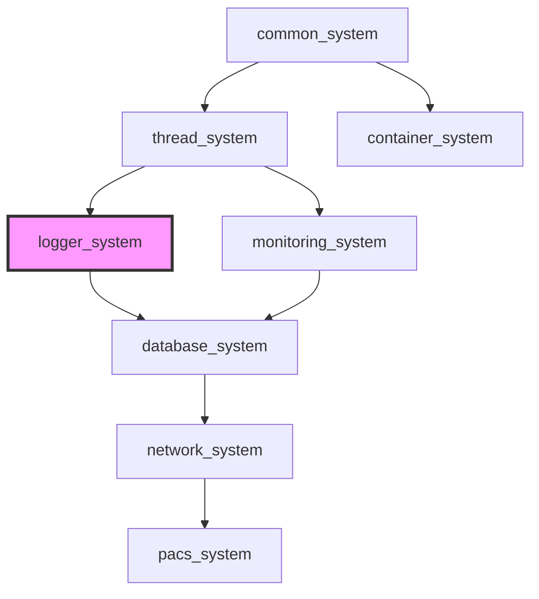

[](https://github.com/kcenon/logger_system/actions/workflows/ci.yml)
[](https://github.com/kcenon/logger_system/actions/workflows/sanitizers.yml)
[](https://github.com/kcenon/logger_system/actions/workflows/benchmarks.yml)
[](https://github.com/kcenon/logger_system/actions/workflows/coverage.yml)
[](https://github.com/kcenon/logger_system/actions/workflows/static-analysis.yml)
[](https://codecov.io/gh/kcenon/logger_system)
[](https://github.com/kcenon/logger_system/actions/workflows/build-Doxygen.yaml)
[](https://github.com/kcenon/logger_system/blob/main/LICENSE)

# Logger System

> **Language:** **English** | [한국어](README.kr.md)

## Table of Contents

- [Overview](#overview)
- [Quick Start](#quick-start)
- [Installation](#installation)
- [Core Features](#core-features)
- [Performance Highlights](#performance-highlights)
- [Architecture Overview](#architecture-overview)
- [Ecosystem Integration](#ecosystem-integration)
- [C++20 Module Support](#c20-module-support)
- [Documentation](#documentation)
- [Configuration Templates](#configuration-templates)
- [Build Configuration](#build-configuration)
- [Platform Support](#platform-support)
- [Testing](#testing)
- [Contributing](#contributing)
- [License](#license)

## Overview

A high-performance C++20 asynchronous logging framework designed for multithreaded applications. Built with a modular, interface-based architecture and seamless ecosystem integration.

**Key Features**:
- 🚀 **Ultra-fast async logging**: 4.34M messages/second, 148ns latency
- 🔒 **Thread-safe by design**: Zero data races, production-proven
- 🏗️ **Modular architecture**: Interface-driven, pluggable components
- 🛡️ **Production-grade**: Comprehensive CI/CD, sanitizers, benchmarks
- 🔐 **Security-first**: Path validation, secure storage, audit logging
- 🌐 **Cross-platform**: Windows, Linux, macOS with GCC, Clang, MSVC

---

## Quick Start

### Basic Example

```cpp
#include <kcenon/logger/core/logger_builder.h>
#include <kcenon/logger/writers/console_writer.h>
#include <kcenon/logger/writers/file_writer.h>

int main() {
    // Create logger using builder pattern with automatic validation
    auto result = kcenon::logger::logger_builder()
        .use_template("production")  // Predefined configuration
        .with_min_level(kcenon::logger::log_level::info)
        .add_writer("console", std::make_unique<kcenon::logger::console_writer>())
        .add_writer("file", std::make_unique<kcenon::logger::file_writer>("app.log"))
        .build();

    if (result.is_err()) {
        const auto& err = result.error();
        std::cerr << "Failed to create logger: " << err.message
                  << " (code: " << err.code << ")\n";
        return -1;
    }

    auto logger = std::move(result.value());

    // Log messages with error handling
    logger->log(kcenon::logger::log_level::info, "Application started");
logger->log(kcenon::logger::log_level::error, "Something went wrong");

return 0;
}
```

Need a quick reminder later? See the [Result Handling Cheatsheet](docs/guides/INTEGRATION.md#result-handling-cheatsheet) for canonical snippets that can be reused across the ecosystem.

### Composing Writers with Decorator Pattern

The `writer_builder` provides a fluent API for composing multiple writer behaviors using the Decorator pattern:

```cpp
#include <kcenon/logger/builders/writer_builder.h>

// Create a file writer with async and buffered decorators
auto writer = kcenon::logger::writer_builder()
    .file("app.log")
    .buffered(500)           // Buffer up to 500 entries
    .async(20000)            // Async queue size 20000
    .build();

// Add to logger
logger->add_writer("main", std::move(writer));
```

**Available Core Writers**:
- `.file(path)` - Write to file
- `.console()` - Write to console (stdout/stderr)
- `.custom(writer)` - Use custom writer implementation

**Available Decorators**:
- `.async(queue_size)` - Asynchronous writing with background thread
- `.buffered(max_entries)` - Batch buffering to reduce I/O operations
- `.filtered(filter)` - Log filtering based on level or custom criteria
- `.formatted(formatter)` - Custom formatting before writing
- `.encrypted(key)` - AES-256 encryption for sensitive logs (requires encryption feature)
- `.thread_safe()` - Thread-safe wrapper for concurrent access

#### Decorator Application Order

For optimal performance, decorators should be applied in this order (innermost to outermost):

```
Core Writer → Filtering → Buffering → Encryption → Thread-Safety → Async
```

**Rationale**:
1. **Filtering first** - Reduces work for downstream decorators
2. **Buffering** - Amortizes I/O and processing costs
3. **Encryption** - Encrypts batches efficiently
4. **Thread-safety** - Ensures consistency before async processing
5. **Async last** - Maximizes non-blocking benefits

#### Common Usage Patterns

**High-Throughput Pattern** (4M+ messages/second):
```cpp
auto writer = kcenon::logger::writer_builder()
    .file("app.log")
    .buffered(1000)      // Large buffer
    .async(50000)        // Large queue
    .build();
```

**Secure Logging Pattern** (Compliance):
```cpp
#ifdef LOGGER_WITH_ENCRYPTION
auto writer = kcenon::logger::writer_builder()
    .file("audit.log.enc")
    .buffered(200)                      // Buffer before encryption
    .encrypted(std::move(encryption_key))
    .async(10000)
    .build();
#endif
```

**Filtered Error Log** (Separate error tracking):
```cpp
auto error_filter = std::make_unique<level_filter>(log_level::error);
auto error_writer = kcenon::logger::writer_builder()
    .file("errors.log")
    .filtered(std::move(error_filter))  // Filter first
    .buffered(100)
    .async()
    .build();
```

**Production Multi-Writer Setup**:
```cpp
logger log;

// Main log: all messages with async+buffered for high performance
auto main_writer = kcenon::logger::writer_builder()
    .file("app.log")
    .buffered(500)
    .async(20000)
    .build();

// Start async writer before adding to logger
if (auto* async_w = dynamic_cast<async_writer*>(main_writer.get())) {
    async_w->start();
}
log.add_writer("main", std::move(main_writer));

// Error log: only errors, separate file
auto error_filter = std::make_unique<level_filter>(log_level::error);
auto error_writer = kcenon::logger::writer_builder()
    .file("errors.log")
    .filtered(std::move(error_filter))
    .async()
    .build();

if (auto* async_w = dynamic_cast<async_writer*>(error_writer.get())) {
    async_w->start();
}
log.add_writer("errors", std::move(error_writer));

// Console for development
log.add_writer("console", writer_builder().console().build());
```

For comprehensive examples including all decorators, performance patterns, and real-world scenarios, see:
- [examples/decorator_usage.cpp](examples/decorator_usage.cpp) - Complete decorator pattern guide
- [examples/writer_builder_example.cpp](examples/writer_builder_example.cpp) - Builder pattern examples

> **Migration Notice**: If you're upgrading from earlier versions that use manual decorator nesting, see the [Decorator Pattern Migration Guide](docs/guides/DECORATOR_MIGRATION.md#deprecation-timeline-and-legacy-patterns) for migration scenarios. Manual nesting is deprecated in favor of `writer_builder` and will be discouraged in v5.0.0.

### Installation

**Using vcpkg**:
```bash
# Install with the default feature set (no optional third-party dependencies)
vcpkg install kcenon-logger-system

# Install with benchmarks (includes spdlog for comparison)
vcpkg install kcenon-logger-system[benchmarks]

# Install with OpenTelemetry integration
vcpkg install kcenon-logger-system[otlp]

# Install with encryption support
vcpkg install kcenon-logger-system[encryption]
```

> **Note**: Ecosystem dependencies (common_system, thread_system) are not yet registered in vcpkg. Until then, use the CMake build with local clones. See [Building with Dependencies](#building-with-dependencies).

**Using CMake**:
```bash
mkdir build && cd build
cmake ..
cmake --build .
cmake --build . --target install
```

**Using in Your Project**:
```cmake
find_package(LoggerSystem REQUIRED)
target_link_libraries(your_app PRIVATE LoggerSystem::logger)
```

### Requirements

| Dependency | Version | Required | Description |
|------------|---------|----------|-------------|
| C++20 Compiler | GCC 11+ / Clang 14+ / MSVC 2022+ / Apple Clang 14+ | Yes | C++20 features required |
| CMake | 3.20+ | Yes | Build system |
| [common_system](https://github.com/kcenon/common_system) | latest | Yes | Common interfaces (ILogger, Result<T>) |
| [thread_system](https://github.com/kcenon/thread_system) | latest | Optional | Async logging with thread pool support |
| [kcenon-common-system](https://github.com/kcenon/common_system) | 0.2.0 | Yes | Installed automatically via vcpkg (`kcenon-common-system`) |
| vcpkg | latest | Optional | Package management |

> **Note**: `kcenon-common-system` is the only required production dependency and is installed automatically when using vcpkg. Optional features add OpenSSL (`encryption`), OpenTelemetry/gRPC/Protocol Buffers (`otlp`), or spdlog (`benchmarks`) only when explicitly enabled. See [docs/SOUP.md](docs/SOUP.md) and [LICENSE-THIRD-PARTY](LICENSE-THIRD-PARTY) for the authoritative dependency inventory.

#### Optional Feature Dependencies

| Feature | Third-Party Dependencies | Purpose |
|---------|--------------------------|---------|
| `encryption` | OpenSSL | AES-256-GCM encrypted log writer |
| `otlp` | OpenTelemetry C++ SDK, gRPC, Protocol Buffers | OTLP telemetry export |
| `benchmarks` | spdlog | Benchmark comparison against another logging library |
| `thread-system` | kcenon-thread-system | Thread pool and async executor integration |

#### Development and Benchmark Dependencies

| Category | Dependencies | Purpose |
|----------|--------------|---------|
| Test-only | Google Test | Unit tests and mocks |
| Benchmark-only | Google Benchmark | Performance benchmarks |

#### Dependency Flow

```
logger_system
├── common_system (required)
└── thread_system (optional, for async logging with thread pool)
    └── common_system (required)
```

#### Building with Dependencies

```bash
# Clone dependencies
git clone https://github.com/kcenon/common_system.git
git clone https://github.com/kcenon/thread_system.git  # Optional

# Clone and build logger_system
git clone https://github.com/kcenon/logger_system.git
cd logger_system
cmake -B build -DLOGGER_USE_THREAD_SYSTEM=ON  # Enable thread_system integration
cmake --build build
```

---

## Core Features

### Asynchronous Logging
- **Non-blocking operations**: Background thread handles I/O without blocking
- **Batched processing**: Processes multiple log entries efficiently
- **Adaptive batching**: Intelligent optimization based on queue utilization
- **Zero-copy design**: Minimal allocations and overhead

### Multiple Writer Types
- **Console Writer**: ANSI colored output for different log levels
- **File Writer**: Buffered file output with configurable settings
- **Rotating File Writer**: Size/time-based rotation with compression
- **Network Writer**: TCP/UDP remote logging
- **Critical Writer**: Synchronous logging for critical messages
- **Hybrid Writer**: Automatic async/sync switching based on log level
- **Encrypted Writer**: AES-256-GCM encrypted log storage
- **OTLP Writer**: OpenTelemetry Protocol export for observability (v3.0.0)

[📚 Detailed Writer Documentation →](docs/FEATURES.md#writer-types)

### OpenTelemetry Integration (v3.0.0)
- **Trace Correlation**: Automatic trace_id/span_id in logs
- **OTLP Export**: HTTP and gRPC transport protocols
- **Batch Export**: Efficient network utilization
- **Resource Attributes**: Service name, version, custom metadata
- **Context Propagation**: Thread-local trace context storage

[🔭 OpenTelemetry Guide →](docs/guides/OPENTELEMETRY.md)

### Security Features (v3.0.0)
- **Secure Key Storage**: RAII-based encryption key management with automatic cleanup
- **Encrypted Writer**: AES-256-GCM encrypted log storage with per-entry IV rotation
- **Path Validation**: Protection against path traversal attacks
- **Signal Handler Safety**: Emergency flush for crash scenarios
- **Security Audit Logging**: Tamper-evident audit trail with HMAC-SHA256
- **Compliance Support**: GDPR, PCI DSS, ISO 27001, SOC 2

[🔒 Complete Security Guide →](docs/FEATURES.md#security-features)

### Structured Logging (v3.1.0)
- **Fluent Builder API**: Chain field additions with `.field("key", value).emit()`
- **Type-safe Fields**: Support for string, int64, double, and boolean values
- **Context Fields**: Persistent fields automatically included in all logs
- **JSON Output**: Structured fields in JSON formatter output
- **Level-specific Methods**: `info_structured()`, `error_structured()`, etc.

```cpp
// Set persistent context fields
logger->set_context("service", "api-gateway");
logger->set_context("version", "1.0.0");

// Create structured log entries
logger->info_structured()
    .message("User login")
    .field("user_id", 12345)
    .field("ip_address", "192.168.1.1")
    .field("success", true)
    .emit();
```

---

## Performance Highlights

*Benchmarked on Apple M1 (8-core) @ 3.2GHz, 16GB, macOS Sonoma*

### Throughput

| Configuration | Throughput | vs spdlog |
|---------------|------------|-----------|
| **Single thread (async)** | **4.34M msg/s** | -19% |
| **4 threads** | **1.07M msg/s** | **+36%** |
| **8 threads** | **412K msg/s** | **+72%** |
| **16 threads** | **390K msg/s** | **+117%** |

### Latency

| Metric | Logger System | spdlog async | Advantage |
|--------|---------------|--------------|-----------|
| **Average** | **148 ns** | 2,325 ns | **15.7x faster** |
| **p99** | **312 ns** | 4,850 ns | **15.5x faster** |
| **p99.9** | **487 ns** | ~7,000 ns | **14.4x faster** |

### Memory Efficiency

- **Baseline**: 1.8 MB (vs spdlog: 4.2 MB, **57% less**)
- **Peak**: 2.4 MB
- **Allocations/msg**: 0.12

**Key Insights**:
- 🏃 **Multi-threaded advantage**: Adaptive batching provides superior scaling
- ⏱️ **Ultra-low latency**: Industry-leading 148ns average enqueue time
- 💾 **Memory efficient**: Minimal footprint with zero-copy design

[⚡ Full Benchmarks & Methodology →](docs/BENCHMARKS.md)

---

## Architecture Overview

### Modular Design

```
┌─────────────────────────────────────────────────────────────┐
│                      Logger Core                            │
│  ┌──────────────┐  ┌──────────────┐  ┌──────────────┐      │
│  │   Builder    │  │  Async Queue │  │   Metrics    │      │
│  └──────────────┘  └──────────────┘  └──────────────┘      │
└───────────────────────┬─────────────────────────────────────┘
                        │
        ┌───────────────┼───────────────┐
        │               │               │
        ▼               ▼               ▼
┌──────────────┐ ┌──────────────┐ ┌──────────────┐
│   Writers    │ │   Filters    │ │  Formatters  │
│              │ │              │ │              │
│ • Console    │ │ • Level      │ │ • Plain Text │
│ • File       │ │ • Regex      │ │ • JSON       │
│ • Rotating   │ │ • Function   │ │ • Logfmt     │
│ • Network    │ │ • Composite  │ │ • Custom     │
│ • Critical   │ │              │ │              │
│ • Hybrid     │ │              │ │              │
└──────────────┘ └──────────────┘ └──────────────┘
```

### Key Components

- **Logger Core**: Main async processing engine with builder pattern
- **Writers**: Pluggable output destinations (file, console, network, etc.)
- **Filters**: Conditional logging based on level, pattern, or custom logic
- **Formatters**: Configurable output formats (plain, JSON, logfmt, custom)
- **Security**: Path validation, secure storage, audit logging

[🏛️ Detailed Architecture Guide →](docs/ARCHITECTURE.md)

---

## Ecosystem Integration

### Ecosystem Dependency Map



> **Ecosystem reference**:
> [common_system](https://github.com/kcenon/common_system) — Tier 0: ILogger interface and Result&lt;T&gt; pattern
> [thread_system](https://github.com/kcenon/thread_system) — Tier 1: Thread pool for async log processing (optional)
> [monitoring_system](https://github.com/kcenon/monitoring_system) — Tier 3: Metrics and health monitoring (optional)

Part of a modular C++ ecosystem with clean interface boundaries:

### Dependencies

**Required**:
- **[common_system](https://github.com/kcenon/common_system)**: Core interfaces (ILogger, IMonitor, Result<T>) with C++20 Concepts support

**Optional**:
- **[thread_system](https://github.com/kcenon/thread_system)**: Enhanced threading primitives (optional since v3.1.0)
- **[monitoring_system](https://github.com/kcenon/monitoring_system)**: Metrics and health monitoring

> **Note**: Since v3.1.0, `thread_system` is optional. The logger system uses a standalone std::jthread implementation by default. For advanced async processing, enable thread_system integration with `-DLOGGER_USE_THREAD_SYSTEM=ON` (see Issue #224).

### Integration Pattern

```cpp
#include <kcenon/logger/core/logger.h>
#include <kcenon/logger/core/logger_builder.h>
#include <kcenon/logger/writers/console_writer.h>

int main() {
    // Create logger using builder pattern (standalone mode, no thread_system required)
    auto logger = kcenon::logger::logger_builder()
        .use_template("production")
        .add_writer("console", std::make_unique<kcenon::logger::console_writer>())
        .build()
        .value();

    // Use logger anywhere in your application
    logger->log(kcenon::logger::log_level::info, "System initialized");

    return 0;
}
```

> **Note**: When `thread_system` is available and `LOGGER_HAS_THREAD_SYSTEM` is defined (via `-DLOGGER_USE_THREAD_SYSTEM=ON`), additional integration features are enabled including shared thread pool for async processing. See [thread_system integration](docs/integration/THREAD_SYSTEM.md) for details.

**Benefits**:
- Interface-only dependencies (no circular references)
- Independent compilation and deployment
- Runtime component injection via DI pattern
- Clean separation of concerns

[🔗 Ecosystem Integration Guide →](docs/guides/INTEGRATION.md)

---

## C++20 Module Support

Logger System provides C++20 module support as an alternative to the header-based interface.

### Requirements for Modules

- **CMake 3.28+**
- **Clang 16+, GCC 14+, or MSVC 2022 17.4+**
- **common_system** with module support

### Building with Modules

```bash
cmake -B build -DLOGGER_USE_MODULES=ON
cmake --build build
```

### Using Modules

```cpp
import kcenon.logger;

int main() {
    // Use logger components directly
    auto logger = kcenon::logger::create_logger("app");
    logger->info("Hello from C++20 modules!");
}
```

### Module Structure

| Module | Contents |
|--------|----------|
| `kcenon.logger` | Primary module (imports all partitions) |
| `kcenon.logger:core` | Core logging infrastructure |
| `kcenon.logger:backends` | Output backends (console, file, network) |
| `kcenon.logger:analysis` | Log analysis and filtering |

> **Note**: C++20 modules are experimental. The header-based interface remains the primary API.

---

## Documentation

### Getting Started
- 📖 [Getting Started Guide](docs/guides/GETTING_STARTED.md) - Step-by-step setup and basic usage
- 🚀 [Quick Start Examples](examples/) - Hands-on examples
- 🔧 [Quick Start Guide](docs/guides/QUICK_START.md) - Detailed build and startup instructions<!-- TODO: docs/guides/BUILD_GUIDE.md does not exist -->

### Core Documentation
- 📘 [Features](docs/FEATURES.md) - Comprehensive feature documentation
- 📊 [Benchmarks](docs/BENCHMARKS.md) - Performance analysis and comparisons
- 🏗️ [Architecture](docs/ARCHITECTURE.md) - System design and internals
- 📋 [Project Structure](docs/PROJECT_STRUCTURE.md) - Directory organization and files
- 🔧 [API Reference](docs/API_REFERENCE.md) - Complete API documentation

### Advanced Topics
- ⚡ [Performance Guide](docs/guides/PERFORMANCE.md) - Optimization tips and tuning
- 🔒 [Security Guide](docs/guides/SECURITY.md) - Security considerations and best practices
- ✅ [Production Quality](docs/PRODUCTION_QUALITY.md) - CI/CD, testing, quality metrics
- 🎨 [Custom Writers](docs/advanced/CUSTOM_WRITERS.md) - Creating custom log writers
- 🔄 [Integration Guide](docs/guides/INTEGRATION.md) - Ecosystem integration patterns

### Development
- 🤝 [Contributing Guide](docs/contributing/CONTRIBUTING.md) - How to contribute
- 📋 [FAQ](docs/guides/FAQ.md) - Frequently asked questions
- 🔍 [Troubleshooting](docs/guides/FAQ.md#troubleshooting) - Common issues and solutions<!-- TODO: docs/guides/TROUBLESHOOTING.md does not exist -->
- 📝 [Changelog](docs/CHANGELOG.md) - Release history and changes

---

## Configuration Templates

The logger system provides predefined templates for common scenarios:

```cpp
// Production: Optimized for production environments
auto logger = kcenon::logger::logger_builder()
    .use_template("production")
    .build()
    .value();

// Debug: Immediate output for development
auto logger = kcenon::logger::logger_builder()
    .use_template("debug")
    .build()
    .value();

// High-performance: Maximized throughput
auto logger = kcenon::logger::logger_builder()
    .use_template("high_performance")
    .build()
    .value();

// Low-latency: Minimized latency for real-time systems
auto logger = kcenon::logger::logger_builder()
    .use_template("low_latency")
    .build()
    .value();
```

### Advanced Configuration

```cpp
auto logger = kcenon::logger::logger_builder()
    // Core settings
    .with_min_level(kcenon::logger::log_level::info)
    .with_buffer_size(16384)
    .with_batch_size(200)
    .with_queue_size(20000)

    // Add multiple writers
    .add_writer("console", std::make_unique<kcenon::logger::console_writer>())
    .add_writer("file", std::make_unique<kcenon::logger::rotating_file_writer>(
        "app.log",
        10 * 1024 * 1024,  // 10MB per file
        5                   // Keep 5 files
    ))

    // Build with validation
    .build()
    .value();
```

[📚 Complete Configuration Guide →](docs/CONFIGURATION_STRATEGIES.md)<!-- TODO: docs/guides/CONFIGURATION.md does not exist; using CONFIGURATION_STRATEGIES instead -->

---

## Build Configuration

### CMake Feature Flags

```bash
# Core Features
cmake -DLOGGER_USE_DI=ON              # Dependency injection (default: ON)
cmake -DLOGGER_USE_MONITORING=ON      # Monitoring support (default: ON)
cmake -DLOGGER_ENABLE_ASYNC=ON        # Async logging (default: ON)
cmake -DLOGGER_ENABLE_CRASH_HANDLER=ON # Crash handler (default: ON)

# Advanced Features
cmake -DLOGGER_ENABLE_STRUCTURED_LOGGING=ON # JSON logging (default: OFF)
cmake -DLOGGER_ENABLE_NETWORK_WRITER=ON # Network writer (default: OFF)
cmake -DLOGGER_ENABLE_FILE_ROTATION=ON  # File rotation (default: ON)

# Performance Tuning
cmake -DLOGGER_DEFAULT_BUFFER_SIZE=16384 # Buffer size in bytes
cmake -DLOGGER_DEFAULT_BATCH_SIZE=200    # Batch processing size
cmake -DLOGGER_DEFAULT_QUEUE_SIZE=20000  # Maximum queue size

# Quality Assurance
cmake -DLOGGER_ENABLE_SANITIZERS=ON   # Enable sanitizers
cmake -DLOGGER_ENABLE_COVERAGE=ON     # Code coverage
cmake -DLOGGER_WARNINGS_AS_ERRORS=ON  # Treat warnings as errors
```

[🔧 Complete Build Options →](docs/guides/QUICK_START.md)<!-- TODO: docs/guides/BUILD_GUIDE.md does not exist -->

---

## Platform Support

### Officially Supported

| Platform | Architecture | Compilers | Status |
|----------|--------------|-----------|--------|
| **Ubuntu 22.04+** | x86_64, ARM64 | GCC 11+, Clang 14+ | ✅ Fully tested |
| **macOS Sonoma+** | x86_64, ARM64 (M1/M2) | Apple Clang 14+ | ✅ Fully tested |
| **Windows 11** | x86_64 | MSVC 2022 | ✅ Fully tested |

**Minimum Requirements**:
- C++20 compiler
- CMake 3.20+
- No required third-party production packages in the default build

[🖥️ Platform Details →](docs/PRODUCTION_QUALITY.md#platform-support)

---

## Testing

The logger system includes comprehensive testing infrastructure:

### Test Coverage

- **Unit Tests**: 150+ test cases (GTest)
- **Integration Tests**: 30+ scenarios
- **Benchmarks**: 20+ performance tests
- **Coverage**: ~65% (growing)

### Running Tests

```bash
# Build with tests
cmake -DBUILD_TESTS=ON ..
cmake --build .

# Run all tests
ctest --output-on-failure

# Run specific test suite
./build/bin/core_tests
./build/bin/writer_tests

# Run benchmarks
./build/bin/benchmarks
```

### CI/CD Status

All pipelines green:
- ✅ Multi-platform builds (Ubuntu, macOS, Windows)
- ✅ Sanitizers (Thread, Address, UB)
- ✅ Performance benchmarks
- ✅ Code coverage
- ✅ Static analysis (clang-tidy, cppcheck)

[✅ Production Quality Metrics →](docs/PRODUCTION_QUALITY.md)

---

## Contributing

We welcome contributions! Please see our [Contributing Guide](docs/contributing/CONTRIBUTING.md) for details.

### Development Workflow

1. Fork the repository
2. Create your feature branch: `git checkout -b feature/amazing-feature`
3. Commit your changes: `git commit -m 'Add amazing feature'`
4. Push to the branch: `git push origin feature/amazing-feature`
5. Open a Pull Request

### Code Standards

- Follow modern C++ best practices
- Use RAII and smart pointers
- Write comprehensive unit tests
- Maintain consistent formatting (clang-format)
- Document public APIs

[🤝 Contributing Guidelines →](docs/contributing/CONTRIBUTING.md)

---

## Support

- **Issues**: [GitHub Issues](https://github.com/kcenon/logger_system/issues)
- **Discussions**: [GitHub Discussions](https://github.com/kcenon/logger_system/discussions)
- **Email**: kcenon@naver.com

---

## License

This project is licensed under the BSD 3-Clause License - see the [LICENSE](LICENSE) file for details.

---

## Acknowledgments

- Inspired by modern logging frameworks (spdlog, Boost.Log, glog)
- Built with C++20 features (GCC 11+, Clang 14+, MSVC 2022+) for maximum performance and safety
- Maintained by kcenon@naver.com

---

<p align="center">
  Made with ❤️ by 🍀☀🌕🌥 🌊
</p>
