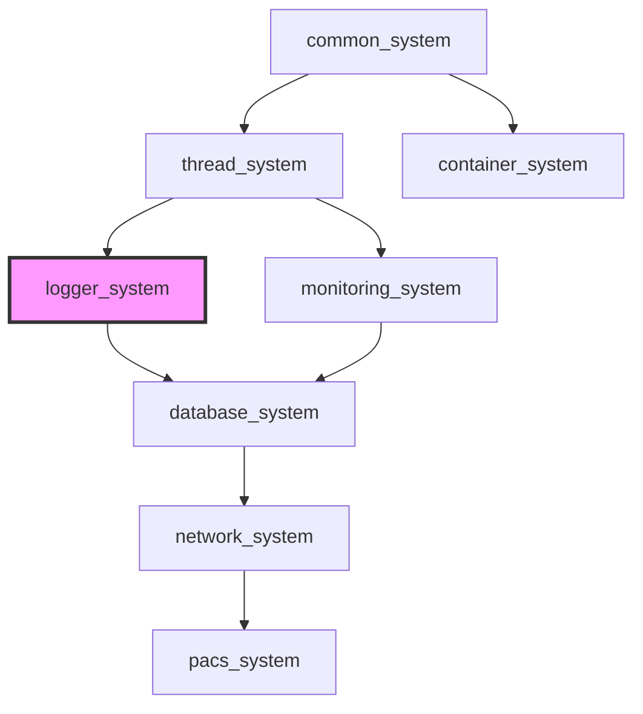

> **Language:** **English** | [한국어](ARCHITECTURE.kr.md)

# Logger System Architecture

> **SSOT**: This document is the single source of truth for **Logger System Architecture**.

**Version**: 0.4.0.0
**Last Updated**: 2026-02-08

Logger system internal architecture and ecosystem integration overview.

## Table of Contents

- [Logger Pipeline Architecture](#-logger-pipeline-architecture)
- [Writer Architecture](#-writer-architecture)
- [OTLP & Observability Pipeline](#-otlp--observability-pipeline)
- [Sampling & Analysis Pipeline](#-sampling--analysis-pipeline)
- [Ecosystem Overview](#-ecosystem-overview)
- [Project Roles & Responsibilities](#-project-roles--responsibilities)
- [Dependency Flow & Interface Contracts](#-dependency-flow--interface-contracts)
- [Integration Patterns](#-integration-patterns)
- [Performance Characteristics](#-performance-characteristics)
- [Evolution: Monolithic → Modular](#-evolution-monolithic--modular)
- [Getting Started](#-getting-started)
- [Documentation Structure](#-documentation-structure)
- [Future Roadmap](#-future-roadmap)

## Overview

> **Cross-reference**:
> [API Reference](./API_REFERENCE.md) — Logger, writer, and builder APIs
> [Benchmarks](./BENCHMARKS.md) — Throughput and latency measurements
> [Configuration Strategies](./CONFIGURATION_STRATEGIES.md) — Logger setup patterns
> [Dependency Architecture](./DEPENDENCY_ARCHITECTURE.md) — Build-time dependency details

> **Ecosystem reference**:
> [common_system API](https://github.com/kcenon/common_system/blob/main/docs/API_REFERENCE.md) — ILogger interface and Result&lt;T&gt; error handling
> [thread_system Architecture](https://github.com/kcenon/thread_system/blob/main/docs/ARCHITECTURE.md) — Thread pool used for async logging

---

## Logger Pipeline Architecture

The logger system implements a multi-stage asynchronous pipeline for processing log entries from application code to output destinations.

### Pipeline Flow

```
Application Code
    │
    ▼
┌──────────────────────────────────────────────────────────┐
│  logger (PIMPL)                                          │
│  ┌─────────┐   ┌──────────┐   ┌─────────────────────┐   │
│  │ Sampler  │──▶│  Filter  │──▶│  Async Queue        │   │
│  │(optional)│   │(optional)│   │  (lock-free/mutex)  │   │
│  └─────────┘   └──────────┘   └──────────┬──────────┘   │
│                                           │              │
│  ┌────────────────────────────────────────▼──────────┐   │
│  │  Processing Thread (std::jthread or thread_pool)  │   │
│  │                                                    │   │
│  │  ┌─────────┐   ┌───────────┐   ┌──────────────┐  │   │
│  │  │ Router  │──▶│ Formatter │──▶│   Writers     │  │   │
│  │  │(optional)│   │           │   │              │  │   │
│  │  └─────────┘   └───────────┘   │ ┌──────────┐ │  │   │
│  │                                 │ │ console  │ │  │   │
│  │  ┌──────────────────────┐       │ │ file     │ │  │   │
│  │  │ Realtime Analyzer    │       │ │ rotating │ │  │   │
│  │  │ (anomaly detection)  │       │ │ network  │ │  │   │
│  │  └──────────────────────┘       │ │ otlp     │ │  │   │
│  │                                 │ │ batch    │ │  │   │
│  │  ┌──────────────────────┐       │ │ critical │ │  │   │
│  │  │ Metrics Collector    │       │ └──────────┘ │  │   │
│  │  │ (performance stats)  │       └──────────────┘  │   │
│  │  └──────────────────────┘                          │   │
│  └────────────────────────────────────────────────────┘   │
└──────────────────────────────────────────────────────────┘
```

### Backend Selection Strategy

```
                     ┌────────────────┐
                     │ logger_builder │
                     └───────┬────────┘
                             │
              ┌──────────────┴──────────────┐
              ▼                             ▼
    ┌──────────────────┐          ┌──────────────────┐
    │standalone_backend│          │thread_pool_backend│
    │  (Default v3.0)  │          │   (Optional)      │
    │                  │          │                    │
    │ • std::jthread   │          │ • thread_pool      │
    │ • Self-contained │          │ • Work-stealing    │
    │ • No dependencies│          │ • Requires         │
    └──────────────────┘          │   thread_system    │
                                  └──────────────────┘
```

### Key Architectural Decisions

1. **PIMPL Pattern**: Logger uses PIMPL for ABI stability and compilation firewall
2. **Move-Only log_entry**: Uses `small_string_256` to minimize heap allocations
3. **Optional Components**: Sampler, filter, router, and analyzer are all optional with zero overhead when disabled
4. **Decorator Pattern**: Writers can be wrapped (encrypted, buffered, async, formatted) for composable behavior

---

## ✍️ Writer Architecture

Writers follow a decorator/composite pattern for flexible composition:

```
log_writer_interface (abstract)
    │
    ├── base_writer (formatter support)
    │   ├── console_writer      (stdout/stderr)
    │   ├── file_writer          (single file)
    │   ├── rotating_file_writer (size/time rotation)
    │   ├── network_writer       (TCP/UDP transport)
    │   └── otlp_writer          (OTLP/HTTP/gRPC export)
    │
    ├── Decorator Writers
    │   ├── async_writer         (async wrapping)
    │   ├── buffered_writer      (output buffering)
    │   ├── batch_writer         (batched output)
    │   ├── filtered_writer      (per-writer filtering)
    │   ├── formatted_writer     (per-writer formatting)
    │   └── encrypted_writer     (encryption layer)
    │
    ├── critical_writer          (signal-safe path)
    └── composite_writer         (fan-out to multiple writers)
```

**Writer Categories**:
- `sync_writer_tag`: Synchronous write, blocks caller
- `async_writer_tag`: Asynchronous write, uses internal queue (otlp_writer, network_writer)

---

## 🔭 OTLP & Observability Pipeline

```
log_entry + otel_context
    │
    ▼
┌─────────────────────────────────────────────┐
│  otlp_writer                                │
│  ┌──────────────┐   ┌──────────────────┐    │
│  │ Batch Queue  │──▶│ HTTP/gRPC Export │    │
│  │ (max 10K)    │   │ (configurable)   │    │
│  └──────────────┘   └────────┬─────────┘    │
│                              │              │
│  ┌──────────────────────────▼──────────┐    │
│  │ Retry Engine (exponential backoff)  │    │
│  │ max_retries × retry_delay × 2^n    │    │
│  └─────────────────────────────────────┘    │
└─────────────────────────────────────────────┘
    │
    ▼
OpenTelemetry Collector → Jaeger / Zipkin / Grafana Tempo
```

**Trace Context Flow**:
- `otel_context_storage` provides thread-local trace context
- `otel_context_scope` (RAII) manages context lifecycle
- Log entries automatically include trace_id/span_id when context is set

---

## 📊 Sampling & Analysis Pipeline

```
log_entry
    │
    ├──▶ log_sampler (pre-filter)
    │    ├── random (xorshift64 PRNG)
    │    ├── rate_limiting (token bucket)
    │    ├── adaptive (volume-based adjustment)
    │    └── hash_based (FNV-1a, deterministic)
    │
    └──▶ realtime_log_analyzer (post-process)
         ├── Error spike detection (sliding window)
         ├── Pattern matching (compiled regex)
         ├── Rate anomaly detection (baseline comparison)
         └── New error type tracking (message normalization)
             │
             ▼
         anomaly_callback → alerting system
```

**Design Principles**:
- Sampling occurs BEFORE enqueueing (reduces queue pressure)
- Analysis occurs AFTER dequeuing (non-blocking for producers)
- `always_log_levels` bypass sampling entirely (error/critical never dropped)
- Adaptive sampling adjusts rate based on observed throughput

---

## 🏗️ Ecosystem Overview

The unified_system ecosystem consists of five interconnected projects designed to provide a complete, high-performance concurrent programming solution:

```
                    ┌─────────────────────────────┐
                    │   Application Layer         │
                    │                             │
                    │   Your Production Apps      │
                    └─────────────┬───────────────┘
                                  │
                    ┌─────────────▼───────────────┐
                    │ integrated_thread_system    │
                    │ (Integration Hub)           │
                    │                             │
                    │ • Complete Examples         │
                    │ • Integration Tests         │
                    │ • Best Practices            │
                    │ • Migration Guides          │
                    └─────────────┬───────────────┘
                                  │ uses all
        ┌─────────────────────────┼─────────────────────────┐
        │                         │                         │
        ▼                         ▼                         ▼
┌───────────────┐     ┌───────────────┐     ┌─────────────────┐
│ thread_system │     │ logger_system │     │monitoring_system│
│  (Optional)   │     │   (Logging)   │     │   (Metrics)     │
│               │     │               │     │                 │
│ Enhanced      │     │ Implements    │     │ Implements      │
│ threading     │     │ ILogger       │     │ IMonitor        │
│ primitives    │     │ interface     │     │ interface       │
└───────┬───────┘     └───────┬───────┘     └────────┬────────┘
        │                     │                      │
        └─────────────────────┼──────────────────────┘
                              │
                    ┌─────────▼─────────┐
                    │   common_system   │
                    │   (Foundation)    │
                    │                   │
                    │ • ILogger         │
                    │ • IMonitor        │
                    │ • Result<T>       │
                    │ • C++20 Concepts  │
                    └───────────────────┘
```

## 📋 Project Roles & Responsibilities

### 1. common_system (Foundation) - **Required**
**Repository**: https://github.com/kcenon/common_system
**Role**: Core interfaces and utilities for the ecosystem

#### Responsibilities:
- **Interface Definitions**: `ILogger`, `IMonitor`, `IExecutor` interfaces
- **Result Pattern**: `Result<T>`, `VoidResult` for error handling
- **C++20 Concepts**: Type constraints for interface implementations
- **Common Utilities**: `source_location`, error codes, type traits

#### Key Components:
```cpp
namespace common::interfaces {
    // Core logging interface
    class ILogger {
    public:
        virtual VoidResult log(log_level level, const std::string& message) = 0;
        virtual VoidResult log(log_level level, std::string_view message,
                               const source_location& loc = source_location::current()) = 0;
        virtual bool is_enabled(log_level level) const = 0;
        virtual VoidResult set_level(log_level level) = 0;
        virtual log_level get_level() const = 0;
        virtual VoidResult flush() = 0;
    };

    // Core monitoring interface
    class IMonitor {
    public:
        virtual void record_metric(const std::string& name, double value) = 0;
        virtual void increment_counter(const std::string& name, int64_t delta = 1) = 0;
        // ...
    };

    // Log level enumeration
    enum class log_level { trace, debug, info, warn, error, fatal };
}

namespace common {
    // Result pattern for error handling
    template<typename T>
    class Result;
    using VoidResult = Result<void>;

    // C++20 source location wrapper
    struct source_location;
}
```

#### Dependencies:
- **External**: None (standalone foundation)
- **Internal**: Self-contained

---

### 2. logger_system (Logging) - **Standalone Capable**
**Repository**: https://github.com/kcenon/logger_system
**Role**: High-performance asynchronous logging implementation

#### Responsibilities:
- **Interface Implementation**: Implements `common::interfaces::ILogger`
- **Standalone Mode**: Works without thread_system using `std::jthread`
- **Asynchronous Logging**: High-throughput batching pipeline
- **Multiple Writers**: Console, file, network, and custom output targets
- **Thread Safety**: Safe concurrent access from multiple threads

#### Key Components:
```cpp
namespace kcenon::logger {
    // Main logger implementation (v3.0)
    class logger : public common::interfaces::ILogger,
                   public security::critical_logger_interface {
    public:
        // ILogger interface
        common::VoidResult log(common::interfaces::log_level level,
                               const std::string& message) override;
        common::VoidResult log(common::interfaces::log_level level,
                               std::string_view message,
                               const common::source_location& loc) override;

        // Native API (backward compatible)
        void log(log_level level, const std::string& message);
    };

    // Builder pattern
    class logger_builder;

    // Writers
    class console_writer;
    class file_writer;
    class rotating_file_writer;
    class network_writer;
    class critical_writer;
    class batch_writer;
}
```

#### Dependencies:
- **Required**: common_system (for `ILogger` interface and `Result<T>`)
- **Optional**: thread_system (for enhanced threading, disabled by default since v3.0)
- **Internal**: Standalone async processing using `std::jthread`

---

### 3. thread_system (Threading) - **Optional**
**Repository**: https://github.com/kcenon/thread_system
**Role**: Enhanced threading primitives and worker pools

> **Note**: Since logger_system v3.0, thread_system is **optional**. The logger operates in standalone mode by default using `std::jthread`.

#### Responsibilities:
- **Thread Pools**: Worker pool management
- **Job Queues**: Thread-safe job distribution
- **Advanced Scheduling**: Priority-based and adaptive scheduling
- **Cross-Platform Threading**: Consistent API across platforms

#### Key Components:
```cpp
namespace thread_module {
    class thread_pool;
    class thread_worker;
    class job_queue;
    class callback_job;
}
```

#### Dependencies:
- **Required**: common_system
- **Internal**: Self-contained threading logic

---

### 4. monitoring_system (Metrics)
**Repository**: https://github.com/kcenon/monitoring_system
**Role**: Real-time performance monitoring and metrics collection

#### Responsibilities:
- **Interface Implementation**: Implements `common::interfaces::IMonitor`
- **Metrics Collection**: System, application, and custom metrics
- **Historical Storage**: Ring buffer for time-series data
- **Performance Tracking**: Low-overhead metrics collection

#### Key Components:
```cpp
namespace kcenon::monitoring {
    class monitoring : public common::interfaces::IMonitor;

    template<typename T>
    class ring_buffer;

    class metrics_collector;
}
```

#### Dependencies:
- **Required**: common_system (for `IMonitor` interface)
- **Optional**: thread_system, logger_system

---

### 5. integrated_thread_system (Integration Hub)
**Repository**: https://github.com/kcenon/integrated_thread_system
**Role**: Complete integration examples and testing framework

#### Dependencies:
- **Required**: common_system, thread_system, logger_system, monitoring_system

## 🔄 Dependency Flow & Interface Contracts

### Interface Hierarchy (v3.0)

```
common::interfaces::ILogger
    ↑ implements
kcenon::logger::logger

common::interfaces::IMonitor
    ↑ implements
kcenon::monitoring::monitoring
```

### Dependency Graph (v3.0)

```
┌─────────────────┐
│  common_system  │ ← Foundation (REQUIRED for all)
└────────┬────────┘
         │ provides interfaces (ILogger, IMonitor, Result<T>)
         │
         ├────────────────────┬────────────────────┬────────────────────┐
         ▼                    ▼                    ▼                    ▼
┌─────────────────┐  ┌─────────────────┐  ┌─────────────────┐  ┌─────────────────┐
│  logger_system  │  │  thread_system  │  │monitoring_system│  │integrated_thread│
│     v3.0        │  │                 │  │                 │  │    _system      │
│                 │  │                 │  │                 │  │                 │
│ depends on:     │  │ depends on:     │  │ depends on:     │  │ depends on:     │
│ - common_system │  │ - common_system │  │ - common_system │  │ - common_system │
│   (REQUIRED)    │  │   (REQUIRED)    │  │   (REQUIRED)    │  │ - thread_system │
│ - thread_system │  │                 │  │                 │  │ - logger_system │
│   (OPTIONAL)    │  │                 │  │                 │  │ - monitoring_   │
└─────────────────┘  └─────────────────┘  └─────────────────┘  │   system        │
                                                               └─────────────────┘
```

### Build Order Requirements

1. **common_system** (build first - foundation)
2. **thread_system** (optional, parallel with logger_system/monitoring_system)
3. **logger_system** & **monitoring_system** (parallel - both depend on common_system)
4. **integrated_thread_system** (build last - depends on all others)

### Standalone vs Integrated Mode

**Standalone Mode (Default since v3.0):**
```cpp
// No thread_system dependency
auto logger = kcenon::logger::logger_builder()
    .with_standalone_backend()  // Uses std::jthread
    .add_writer("console", std::make_unique<console_writer>())
    .build();
```

## 🔧 Integration Patterns

### 1. Interface-Based Integration (v3.0)

```cpp
// common_system provides interfaces
namespace common::interfaces {
    class ILogger {
    public:
        virtual VoidResult log(log_level level, const std::string& message) = 0;
        virtual VoidResult log(log_level level, std::string_view message,
                               const source_location& loc = source_location::current()) = 0;
        virtual bool is_enabled(log_level level) const = 0;
        virtual VoidResult flush() = 0;
    };
}

// logger_system implements the interface
namespace kcenon::logger {
    class logger : public common::interfaces::ILogger {
        // Implementation provides async, thread-safe logging
        // Works standalone or with thread_system integration
    };
}
```

### 2. Dependency Injection Pattern

```cpp
#include <kcenon/logger/core/logger.h>
#include <kcenon/logger/core/logger_builder.h>
#include <kcenon/logger/writers/console_writer.h>

using namespace kcenon::logger;

// Application integrates systems
auto logger = logger_builder()
    .use_template("production")
    .add_writer("console", std::make_unique<console_writer>())
    .build()
    .value();

// Use through ILogger interface
common::interfaces::ILogger* ilogger = logger.get();
ilogger->log(common::interfaces::log_level::info, "Application started");
```

### 3. Configuration Management

```cpp
// Using configuration strategies
auto logger = logger_builder()
    .for_environment(deployment_env::production)
    .with_performance_tuning(performance_level::high_throughput)
    .auto_configure()  // Read LOG_* environment variables
    .build();
```

### 4. Backend Selection Pattern

```cpp
namespace kcenon::logger::backends {
    // Abstract backend interface
    class integration_backend {
    public:
        virtual common::interfaces::log_level to_common_level(
            logger_system::log_level level) const = 0;
        virtual logger_system::log_level from_common_level(
            common::interfaces::log_level level) const = 0;
    };

    // Standalone backend (default) - uses std::jthread
    class standalone_backend : public integration_backend;

    // Thread system backend (optional) - uses thread_system primitives
    // Requires LOGGER_USE_THREAD_SYSTEM=ON at build time
}
```

## 📊 Performance Characteristics

### Design Principles
- **Zero-Overhead Abstractions**: Interface costs are compile-time only
- **Lock-Free Where Possible**: Minimize contention in hot paths
- **Cache-Friendly Data Structures**: Optimize for modern CPU architectures
- **Adaptive Algorithms**: Self-tuning based on workload characteristics

### Performance Metrics (v3.0)

| Component | Mode | Latency | Throughput | Memory |
|-----------|------|---------|------------|--------|
| logger_system | Standalone async | ~148ns enqueue | 4.34M msg/s | ~2MB base |
| logger_system | Sync mode | ~100μs write | I/O limited | Minimal |
| thread_pool | N/A | < 1μs submit | > 10M jobs/s | < 100MB |
| monitoring_system | N/A | < 10ns update | > 100M/s | < 10MB |

### Standalone vs Thread System Performance

The standalone backend using `std::jthread` provides comparable performance to the thread_system integration for most use cases:

| Metric | Standalone | With thread_system |
|--------|------------|-------------------|
| Single-thread throughput | 4.34M msg/s | 4.34M msg/s |
| Multi-thread (8) | 412K msg/s | 450K msg/s |
| P99 latency | 312ns | 290ns |
| Memory baseline | 1.8MB | 2.1MB |

## 🔄 Evolution: Monolithic → Modular → Standalone

### Phase 1: Monolithic (v1.x)
- All components in single repository
- Tight coupling between logging, threading, monitoring

### Phase 2: Modular (v2.x)
- Separated into individual repositories
- thread_system as required dependency for logger_system
- Interface-based integration

### Phase 3: Standalone (v3.0) - Current
- common_system as foundation
- logger_system works standalone (no thread_system required)
- Implements `common::interfaces::ILogger`
- C++20 features (Concepts, source_location)
- Optional thread_system integration

```
┌─────────────────┐    ┌─────────────────┐    ┌─────────────────┐
│  common_system  │    │  logger_system  │    │monitoring_system│
│     v2.x        │    │     v3.0        │    │     v2.x        │
│                 │    │                 │    │                 │
│ Foundation:     │    │ Features:       │    │ Features:       │
│ • ILogger       │    │ • Standalone    │    │ • IMonitor impl │
│ • IMonitor      │    │ • ILogger impl  │    │ • Metrics       │
│ • Result<T>     │    │ • Dual API      │    │ • Ring buffer   │
│ • Concepts      │    │ • C++20 support │    │ • Low overhead  │
│ • Utilities     │    │ • Optional      │    │                 │
│                 │    │   thread_system │    │                 │
└─────────────────┘    └─────────────────┘    └─────────────────┘
```

### Migration Benefits (v3.0)
- **Reduced Dependencies**: logger_system works without thread_system
- **Simpler Integration**: Just common_system + logger_system
- **Better Testability**: Standalone mode easier to test
- **C++20 Features**: Modern language features
- **Backward Compatibility**: Native API still supported

## 🚀 Getting Started

### 1. Minimal Setup (Standalone)

```bash
# Clone required repositories
git clone https://github.com/kcenon/common_system.git
git clone https://github.com/kcenon/logger_system.git

# Build common_system first
cd common_system && mkdir build && cd build
cmake .. && make -j$(nproc)
cd ../..

# Build logger_system (standalone mode)
cd logger_system && mkdir build && cd build
cmake .. && make -j$(nproc)
```

### 2. Full Ecosystem Setup

```bash
# Create workspace directory
mkdir unified_system && cd unified_system

# Clone all repositories
git clone https://github.com/kcenon/common_system.git
git clone https://github.com/kcenon/thread_system.git
git clone https://github.com/kcenon/logger_system.git
git clone https://github.com/kcenon/monitoring_system.git
git clone https://github.com/kcenon/integrated_thread_system.git
```

### 3. Build Order

```bash
# 1. Build foundation (required)
cd common_system && ./build.sh --clean && cd ..

# 2. Build components (parallel)
cd thread_system && ./build.sh --clean && cd .. &
cd logger_system && ./build.sh --clean && cd .. &
cd monitoring_system && ./build.sh --clean && cd .. &
wait

# 3. Build integration (optional)
cd integrated_thread_system && ./build.sh --clean --local
```

### 4. CMake Integration

```cmake
# Minimal (standalone logger)
find_package(common_system REQUIRED)
find_package(logger_system REQUIRED)

target_link_libraries(your_app PRIVATE
    kcenon::common
    kcenon::logger
)

# With thread_system integration
find_package(thread_system REQUIRED)
target_link_libraries(your_app PRIVATE
    kcenon::common
    kcenon::logger
    kcenon::thread
)
```

## 📚 Documentation Structure

### common_system
- **API Reference**: Interface documentation
- **Error Handling**: Result pattern guide
- **C++20 Features**: Concepts and utilities

### logger_system
- **[API Reference](API_REFERENCE.md)**: Complete API documentation
- **[Architecture](advanced/LOGGER_SYSTEM_ARCHITECTURE.md)**: Internal design
- **[Migration Guide](guides/MIGRATION_GUIDE.md)**: Version migration
- **[Best Practices](guides/BEST_PRACTICES.md)**: Usage patterns

### thread_system
- **API Reference**: Thread pool and worker documentation
- **Threading Guide**: Concurrent programming patterns

### monitoring_system
- **Metrics Guide**: Available metrics
- **Custom Collectors**: Extension patterns

## Ecosystem Dependencies

logger_system sits at **Tier 2** in the kcenon ecosystem, providing logging infrastructure.



> **Ecosystem reference**:
> [common_system](https://github.com/kcenon/common_system) — Tier 0: ILogger interface, Result&lt;T&gt;
> [thread_system](https://github.com/kcenon/thread_system) — Tier 1: Thread pool for async I/O (optional)
> [monitoring_system](https://github.com/kcenon/monitoring_system) — Tier 3: Metrics integration (optional)

---

## Future Roadmap

### Phase 3.1: Enhancement
- ✅ common_system with C++20 Concepts
- ✅ Standalone logger_system (no thread_system required)
- ✅ ILogger interface implementation
- ✅ OTLP writer with HTTP/gRPC support
- ✅ Log sampling (random, rate_limiting, adaptive, hash_based)
- ✅ Real-time log analysis with anomaly detection
- 🔄 Lock-free queue implementation
- 🔄 Enhanced monitoring integration

### Phase 3.2: Optimization (Current)
- 📋 SIMD-optimized string operations
- 📋 Memory pool allocators
- 📋 Zero-copy message passing

### Phase 4: Ecosystem Expansion
- ✅ Distributed tracing support (OTLP integration)
- 📋 HTTP server integration
- 📋 Database connection pooling
- 📋 Cloud-native features

---

**Note**: This architecture demonstrates the evolution toward a more modular, standalone-capable design. The logger_system can now operate independently while still supporting integration with the broader ecosystem when needed.

---

*Last Updated: 2026-02-08*
